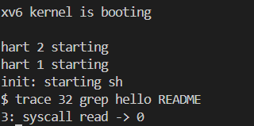

# Đồ án hệ điều hành

## Lab 01: System Call

### A. Làm việc nhóm

#### 1. Thông tin nhóm
|MSSV|Họ và tên|
|---|---|
|23120146|Hoàng Ngọc|
|23120097|Võ Tất Toàn|
|23122004|Lê Thái Ngọc|

#### 2. Đánh giá công việc

|Công việc|Phụ trách|Độ hoàn thiện|
|---|---|---|
|Mã nguồn cho Trace|Lê Thái Ngọc|100%|
|Mã nguồn cho SysInfo|Hoàng Ngọc, Võ Tất Toàn|100%|
|Viết báo cáo|Lê Thái Ngọc, Hoàng Ngọc, Võ Tất Toàn|100%| 

### B. Chi tiết đồ án

### 1. Trace 

#### 1.1 Mô tả chức năng
- Trace cho phép người dùng theo theo dõi được các system call nào được được gọi trong một tiến trình được thực thi.

- Để có thể in ra được system call nào được gọi, ta sẽ sử dụng một biến `mask`. Biến này dùng để kiểm tra xem bit của ID của của system call trong `mask` có đang được bật hay không. Nếu có thì sẽ in ra thông báo.

- Việc tạo ra một chức năng như vậy để thực hiện các tác vụ debug hoặc theo dõi một cách hiệu quả hơn.

#### 1.2. Các bước cài đặt
##### 1.2.1 Không gian Kernel
- Trong file `syscall.h`, định danh mã số cho chức năng (22)
- Trong file `syscall.c`, thực hiện khai báo prototype để nó ánh xạ mã số syscall
```c++
extern uint64 sys_trace(void);
```
- Trong file `syscall.c`, khai báo tên hàm `sys_trace` trong mảng `syscalls[num]`. Mảng này lưu địa chỉ các hàm chức năng trong Kernel, khi đọc số định danh `num` của chức năng từ thanh ghi a7 trong `struct proc` thì bộ não hàm `syscall()` mới biết gọi hàm syscall nào để thực hiện chức năng.

```c++
static uint64 (*syscalls[])(void) = {
    ...
    [SYS_trace]   sys_trace
}
```

- Sau khi khai báo hàm, ta bắt đầu định nghĩa hàm `sys_trace()` trong file `sysproc.c`. Chức năng của hàm này để lấy một giá trị do người dùng nhập vào. Giá trị này sẽ được lưu vào biến `mask` bằng hàm `argint(index, &mask)`. Hàm `argint()` cho lấy tham số giá trị có index = `index` từ không gian User vào không gian Kernel do người dùng nhập vào.
```c++
sys_trace(void)
{
  int mask; // Biến để lưu
  argint(0, &mask); // Nhận thông tin các hàm cần được theo dõi
  ...
  proc->trace_mask = mask; // Lưu vào tiến trình
  ...
}
```

- Để thực hiện được như trên và luôn có thể kiểm tra xem tiến trình hiện tại có đang gọi syscall mà mình theo dõi không, tại `proc.h`, ta chỉnh sửa một chút cấu trúc thông tin của tiến trình.
```c++
struct proc {
  ...
  char name[16];               // Tên tiến trình
  uint trace_mask;             // Thêm biến để diện theo dõi
};
```
- Cuối cùng, cũng là bước quan trọng nhất, để in ra thông tin trên màn hình terminal, ta cần phải xài hàm `printtf()` được định nghĩa trong file `printtf.c`. Tại không gian User, bất kì khi nào tiến trình gọi hàm syscall thì thực hiện so sánh với biến `mask` lưu trong tiến trình đó. Nếu bit của tiến trình đó bật thì in ra.
```c++
void
syscall(void)
{

  struct proc *p = myproc(); // Lấy tiến trình hiện tại

  num = p->trapframe->a7; // Lấy số định danh của syscall cần gọi

  if(num > 0 && num < NELEM(syscalls) && syscalls[num]) // Dựa vào num để tìm syscall cần gọi
    {
    ...
        if (p->trace_mask & (1 << num)) // Kiểm tra sao bit của syscall được gọi có bật không 
        {
        ...
        printf("%d: syscall %s -> %lu\n", p->pid, syscall_names[num], p->trapframe->a0);// in ra
        }
    } 
  else 
    {
        printf("%d %s: unknown sys call %d\n",p->pid, p->name, num); // Không có syscall cần gọi
        ...
    }
}
// Ví dụ minh hoạ nếu syscall read() có mã số 5 và kill() mã số 6 và mask = 64
// read = 1 << 5 => read = 0010 0000 = 64 => in thông tin
// kill = 1 << 4 => kill = 0001 0000 = 32 => không in
```

- Đối với hàm `fork()`, nếu gọi `trace()` mà không thay đổi gì, thì vẫn có thể trace được như bình thường, tuy nhiên, `fork()` có tạo ra tiến trình con, và nó không được trace. Lí do là vì, tiến trình con này là một tiến trình được tạo mới hoàn toàn, có pid khác hoàn toàn, tách biệt với tiến trình cha.
- Thực hiện chỉnh sửa `fork()` để tiến trình con vẫn được trace: Đơn giản, ta chỉ cần copy `trace_mask` từ tiến trình cha vào tiến trình con.

##### 1.2.2 Không gian User
-  Tạo file `trace.c` với tham số là do người dùng nhập vào, sau đó thực hiện khai báo tên hàm tại file `user.h` là `trace(int)` với input là giá trị đại diện cho dãy bit mong muốn theo dõi ID của syscall.
- Sau đó thực hiện định nghĩa hàm `main`, tại đây sẽ gọi hàm `trace(int)` và truyền vào một con số để theo dõi (giả sử truyền vào 32 để theo dõi hàm read có ID = 4). Sau đó thực hiện lệnh `excute()` để tạo ra một tiến trình mới có PID giống tiến trình cũ, thay đổi vùng nhớ nhưng không thay đổi `trace_mask`. Giả sử tiến trình mới là lệnh `grep`, bất kì khi nào tiến trình này gọi `read()` thì sẽ in thông tin ra terminal.
- Thêm `entry("trace")` trong file `usys.pl` để người dùng có thể truy cập
- Thêm trace vào UPROGS trong Makefile

##### 1.2.3 Các bước chạy của chức năng Trace
Giả sử chúng ta chạy lệnh `trace 32 grep hello README` trên hệ điều hành xv6, đây là lệnh theo dõi system call `read()` khi thực hiện tìm chuỗi `"hello"` trong file README

- Bước 1: Gọi hàm `trace(int)` và truyền vào giá trị có đánh dấu bit 1 bật (32).
- Bước 2: Hệ thống sẽ tạo ra một tiến trình, sau đó thực hiện từng chỉ thị theo thứ tự, đến khi đến chỉ thị gọi lệnh `trace(int)` thì tại file `usys.pl` sẽ thực hiện gán mã định danh của chức năng `trace()` vào trong thanh ghi a7, sau đó dùng lệnh `ecall` để nhảy vào không gian Kernel.
```c++
sub entry {
    my $name = shift;
    print ".global $name\n";
    print "${name}:\n";
    print " li a7, SYS_${name}\n"; // Lưu vào thanh ghi a7 mã định danh
    print " ecall\n"; // Nhảy vào Kernel
    print " ret\n";
}
```
- Bước 3: Khi lệnh `ecall` được gọi, hệ điều hành sẽ thực hiện tạo gọi hàm `usertrap()`, tại đây sẽ gọi hàm `syscall()`, đây chính là hàm phân phối chính và nằm trong `syscall.c`
```c++
void
usertrap(void)
{
  ... // Các việc liên quan đến cấu hình
    syscall(); // Khi nào gọi hàm trong Kernel thì gọi hàm này
  ...
}
```

- Bước 4: Tại hàm `syscall()`, khi này ta sẽ ánh xạ và gọi hàm dựa vào việc lấy giá trị mã định danh của thanh ghi a7 và truyền vào mảng lưu địa chỉ các hàm syscall.

```c++
static uint64 (*syscalls[])(void) = 
  {
    ...// Các syscall khác
    [SYS_trace]   sys_trace
  }

  .... // đoạn mã khác
  syscall(void)
  {
    num = p->trapframe->a7; // Lấy mã định danh
    if(num > 0 && num < NELEM(syscalls) && syscalls[num]) // Ánh xạ và gọi hàm trace thông qua num
    {
      ...
    }
  }
```
- Bước 5: Vào hàm `sys_trace`, thực hiện lưu giá trị định danh `32` của chức năng `read()` vào trong `mask` 
- Bước 6: Quay trở lại không gian User bằng `ret`, sau đó thực hiện hàm `exec("grep", "["grep", "hello", "README"])`. Hàm `exec()` sẽ tạo ra tiến trình mới và loại bỏ tiến trình cũ hoàn toàn, và sau đó load tiến trình có tên là `grep` vào hệ thống. Tiến trình mới vẫn lưu giữ `mask` cũ 
- Bước 7: Tại tiến trình mới trong file `grep.c` trong không gian User, tại đây `main` đã gọi hàm có prototype là `grep(pattern, id_file)`, trong hàm này có gọi hàm `read()`, `memmove()`, `write()`,... Nhưng khi gọi đến hàm `read()`, hệ thống lập tức nhảy vô file `usys.pl` một lần nữa gọi hàm `usertrap()` và nhờ đến `syscall()`
- Bước 8: Khi này bộ não `syscall()` vẫn thực hiện lấy mã định danh của syscall cần thực hiện qua thanh ghi a7 và so sánh bằng câu lệnh if. Khi này do syscall được gọi chính là `read()` và khớp với bit của ID chức năng bật trong mask (mask = 32) thì lập tức in ra màn hình.
```c++
  if (p->trace_mask & (1 << num)) {
    printf("%d: syscall %s -> %lu\n", p->pid, syscall_names[num], p->trapframe->a0);
  }
```
- Bước 9: Nhìn kết quả màn hình, vì file README trống nên hàm `read()` chỉ được gọi duy nhất một lần, mỗi lần đọc là 1024 byte kí tự, nếu file dài hơn thì hàm `read()` sẽ được gọi nhiều và hệ thống sẽ in ra nhiều dòng hơn 




### 2. Sysinfo

#### 2.1 Mô tả chức năng
`Sysinfo` là một lời gọi hệ thống (system call) trong hệ điều hành xv6 giúp người dùng thu thập các thông tin về hệ thống đang chạy nhằm quản lý các tài nguyên đang được dùng. `Sysinfo` gồm 3 chức năng chính:
- Hiển thị dung lượng bộ nhớ trống trong hệ thống.
- Hiển thị số tiến trình đang chạy (trạng thái khác "UNUSED"). 
- Hiển thị tổng số tập tin đang được mở bởi các tiến trình kể trên. 

Cụ thể về thuật toán của `sysinfo`:
- Lời gọi hệ thống sysinfo sẽ sử dụng 1 tham số con trỏ đến `struct sysinfo`. `Struct sysinfo` bao gồm 3 thuộc tính: 
    - `freemem` dùng để lưu dung lượng bộ nhớ trống (bytes).
    - `nproc` lưu số lượng tiến trình đang hoạt động.
    - `nopenfiles` lưu số lượng tập tin đang được mở trong toàn bộ hệ thống.
- Hệ thống sẽ chạy các hàm liên quan dưới kernel, sau đó copy toàn bộ kết quả qua không gian người dùng nhằm đảm bảo an toàn dữ liệu.

#### 2.2 Cách cài đặt
##### 2.2.1 Cài đặt các hàm xử lý lời gọi trong không gian Kernel
- Tại **kernel/syscall.h**, định nghĩa số hiệu cho lời gọi hệ thống sysinfo nhằm giúp hệ thống biết được có lời gọi hệ thống sysinfo để có thể sử dụng.  
```c++
#define SYS_sysinfo 23
```
- Taị **kernel/syscall.c**, định nghĩa prototype cho hàm xử lý sysinfo và map lời gọi hệ thống này vào hàm vừa định nghĩa.  
```c++
extern uint64 sys_sysinfo(void);
...
[SYS_sysinfo] sys_sysinfo,
```
- Tại **kernel/sysinfo.h**, ta cần định nghĩa `struct sysinfo`, bao gồm 3 thuộc tính như đã nói ở trên:
```c++
struct sysinfo {
    int freemem;
    int nproc;
    int nopenfiles;
};
```  
- Tại **kernel/kalloc.c**, định nghĩa hàm `countMem()` để tính dung lượng bộ nhớ hệ thống đang trống bằng cách duyệt qua danh sách bộ nhớ trống `run* freelist` của `struct kmem`. Tại hàm này, trước tiên ta sẽ khóa danh sách bộ nhớ trống (tránh trường hợp nhiều tiến trình có thể truy cập vào danh sách bộ nhớ cùng một lúc để bảo vệ dữ liệu), sau đó duyệt qua danh sách bộ nhớ trống và tính tổng dung lượng. Cuối cùng mở khóa danh sách bộ nhớ trống và trả về tổng dung lượng trống đã tính được.
```c++
int 
countMem (void)
{
    struct run *r;
    int freemem = 0;

    acquire(&kmem.lock);
    for (r = kmem.freelist; r != NULL; r = r->next){
        freemem += PGSIZE;
    }
    release(&kmem.lock);

    return freemem;
}
```  
- Tại **kernel/proc.c**, định nghĩa hàm `countProc()` để tính số lượng tiến trình đang không trong trạng thái "UNUSED". Tại hàm này, ta tiến hành duyệt qua danh sách các tiến trình `proc[]` được khai báo tại đầu tập tin **proc.c**. Tại mỗi vòng lặp, ta khóa tiến trình hiện tại (tránh việc tiến trình được truy cập từ các nguồn khác trong lúc được duyệt), kiểm tra trạng thái (state) của tiến trình, nếu khác "UNUSED" thì thêm vào tổng số tiến trình cần tính. Cuối cùng mở khóa cho tiến trình và trả về số lượng tiến trình đã tính sau khi kết thúc vòng lặp.
```c++
int 
countProc(void)
{
    struct proc *p;
    int pnum = 0;

    for (p = proc; p < &proc[NPROC]; p++){
        acquire(&p->lock);
        if (p->state != UNUSED){
            pnum++;
        }
        release(&p->lock);
    }

    return pnum;
}
```
- Tại **kernel/file.c**, định nghĩa hàm `countFiles()` để tính số lượng tập tin đang được mở bởi tất cả các tiến trình trong hệ thống thông qua việc duyệt qua danh sách tất cả các tập tin `file file[NFILE]` trong `struct ftable`. Đầu tiên ta cần khóa danh sách tập tin (tránh các tiến trình khác có thể truy cập vào tập tin trong khi đang duyệt), sau đó tiến hành duyệt qua danh sách tất cả tập tin trong hệ thống. Tại mỗi vòng lặp, ta kiểm tra giá trị `f->ref`, nếu `f->ref > 0` (tức tập tin đang được mở bởi 1 hoặc nhiều tiến trình) thì ta thêm vào tổng số tập tin đang mở. Cuối cùng mở khóa danh sách tập tin và trả về tổng số tập tin đang được mở sau khi kết thúc vòng lặp.
```c++
int countFiles(void)
{
    struct file *f;
    int ofiles = 0;

    acquire(&ftable.lock);
    for (f = ftable.file; f < ftable.file + NFILE; f++){
        if (f->ref > 0) {
            ofiles++;
        }
    }
    release(&ftable.lock);

    return ofiles;
}
```
- Tại **kernel/sysproc.c**, định nghĩa hàm `sys_sysinfo()` để sử dụng những hàm đã được cài đặt ở trên cho lời gọi hệ thống sysinfo. Ta khai báo `struct sysinfo info` dùng để lưu các giá trị tính được tại kernel và `uint64 addr` để copy các giá trị tính được ra không gian người dùng. Hàm `argaddr(0, &addr)` dùng để lưu địa chỉ của tham số đầu tiên khi người dùng gọi `sysinfo()` ở không gian người dùng vào biến `addr` tại kernel. Sau đó gọi các hàm `countMem()`, `countProc()` và `countFiles()` để tính và lưu các giá trị đó vào `struct info` được khai báo ở trên. Cuối cùng, gọi hàm `copyout()` để copy dữ liệu từ `info` tại kernel vào không gian người dùng tại địa chỉ được lưu ở `addr` sử dụng pagetable của tiến trình hiện tại. Nếu thất bại trả về -1, 0 nếu thành công.
```c++
uint64
sys_sysinfo(void)
{
    uint64 addr;
    struct sysinfo info;

    argaddr(0, &addr);

    info.freemem = countMem();
    info.nproc = countProc();
    info.nopenfiles = countFiles();

    if (copyout(myproc()->pagetable, addr, (char *)&info, sizeof(info)) < 0)
        return -1;

    return 0;
}
```


##### 2.2.2 Định nghĩa và cài đặt hàm để gọi sysinfo tại không gian người dùng

- Tại **user/user.h**, định nghĩa hàm để người dùng có thể dùng để gọi sysinfo.
```c++
struct sysinfo;
int sysinfo(struct sysinfo *);
```
- Tại **user/usys.pl**, thêm vào interface để người dùng có thể truy cập sysinfo.
```c++
entry("sysinfo");
```
- Tại **Makefile**, để phục vụ việc biên dịch và chạy chương trình, thêm vào:
```makefile
$U/_sysinfotest\
```
- Tại **user/sysinfotest.c**, định nghĩa hàm `main()` để kiểm tra việc gọi sysinfo.
```c++
int
main()
{
    struct sysinfo info;
    if (sysinfo(&info) < 0) {
        printf("sysinfotest: sysinfo failed\n");
        exit(1);
    }

    printf("Free memory: %d bytes\n", info.freemem);
    printf("Processes: %d\n", info.nproc);
    printf("Open files: %d\n", info.nopenfiles);
    
    exit(0);
}
```
#### 2.3 Các bước chạy của chức năng Sysinfo
- Bước 1: Chạy giống như chức năng `Trace` cho đến lúc vô được hàm `syscall()`, sau đó hàm bộ não sẽ thực hiện gọi hàm `sys_sysinfotest()`
- Bước 2: Trong hàm `sys_sysinfotest()` này thực hiện 3 tác vụ thông qua gọi các hàm con khác nhau.
- Bước 3: Đối với đếm bộ nhớ, duyệt trong `struct fremem` để đếm, mỗi node trống ta cộng thêm kích thước bằng PAGE_SIZE.
- Bước 4: Đối với đếm số tiến trình trạng thái "UNUSED", ta sử dụng con trỏ p* quản lí tiến trình và truy cập mảng các tiến trình và đếm số tiến trình có trạng thái "UNUSED".
- Bước 5: Đếm số file đang mở, ta dựa vào `ftable` và đếm số `struct file` đang có trong mảng
- Bước 6: In ra màn hình và kết quả


