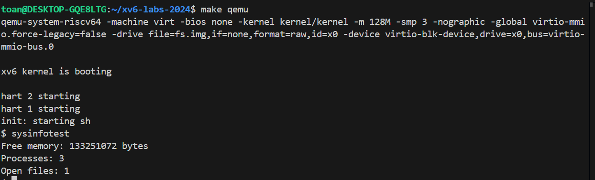

# Lời gọi hệ thống sysinfo
Đây là markdown tập tin chứa tất cả những gì liên quan đến lời gọi hệ thống `sysinfo`. Bao gồm:  
- Nội dung của `sysinfo`.
- Cách cài đặt `sysinfo`.  
- Chạy chương trình và kết quả chương trình.

<br>

## I. Nội dung sysinfo:
`Sysinfo` là một lời gọi hệ thống (system call) trong hệ điều hành xv6 giúp người dùng thu thập các thông tin về hệ thống đang chạy nhằm quản lý các tài nguyên đang được dùng. `Sysinfo` gồm 3 chức năng chính:
- Hiển thị dung lượng bộ nhớ trống trong hệ thống.
- Hiển thị số tiến trình đang chạy (trạng thái khác "UNUSED"). 
- Hiển thị tổng số tập tin đang được mở bởi các tiến trình kể trên.  

<br>

Cụ thể về thuật toán của `sysinfo`:
- Lời gọi hệ thống sysinfo sẽ sử dụng 1 tham số con trỏ đến `struct sysinfo`. `Struct sysinfo` bao gồm 3 thuộc tính: 
    - `freemem` dùng để lưu dung lượng bộ nhớ trống (bytes).
    - `nproc` lưu số lượng tiến trình đang hoạt động.
    - `nopenfiles` lưu số lượng tập tin đang được mở trong toàn bộ hệ thống.
- Hệ thống sẽ chạy các hàm liên quan dưới kernel, sau đó copy toàn bộ kết quả qua không gian người dùng nhằm đảm bảo an toàn dữ liệu.

<br>

## II. Các bước thực hiện cài đặt sysinfo:
Việc cài đặt lời gọi hệ thống sysinfo sẽ được thực hiện thông qua các bước như sau:  
- ### Định nghĩa và khai báo lời gọi hệ thống sysinfo:
    - Tại **kernel/syscall.h**, định nghĩa số hiệu cho lời gọi hệ thống sysinfo nhằm giúp hệ thống biết được có lời gọi hệ thống sysinfo để có thể sử dụng.  
    ```
    #define SYS_sysinfo 23
    ```
    - Taị **kernel/syscall.c**, định nghĩa prototype cho hàm xử lý sysinfo và map lời gọi hệ thống này vào hàm vừa định nghĩa.  
    ```
    extern uint64 sys_sysinfo(void);
    ...
    [SYS_sysinfo] sys_sysinfo,
    ```
- ### Cài đặt các hàm xử lý lời gọi hệ thống sysinfo:  
    - Tại **kernel/sysinfo.h**, ta cần định nghĩa `struct sysinfo`, bao gồm 3 thuộc tính như đã nói ở trên:
    ```
    struct sysinfo {
        int freemem;
        int nproc;
        int nopenfiles;
    };
    ```  
    - Tại **kernel/kalloc.c**, định nghĩa hàm `countMem()` để tính dung lượng bộ nhớ hệ thống đang trống bằng cách duyệt qua danh sách bộ nhớ trống `run* freelist` của `struct kmem`. Tại hàm này, trước tiên ta sẽ khóa danh sách bộ nhớ trống (tránh trường hợp nhiều tiến trình có thể truy cập vào danh sách bộ nhớ cùng một lúc để bảo vệ dữ liệu), sau đó duyệt qua danh sách bộ nhớ trống và tính tổng dung lượng. Cuối cùng mở khóa danh sách bộ nhớ trống và trả về tổng dung lượng trống đã tính được.
    ```
    int 
    countMem (void)
    {
        struct run *r;
        int freemem = 0;

        acquire(&kmem.lock);
        for (r = kmem.freelist; r; r = r->next){
            freemem += PGSIZE;
        }
        release(&kmem.lock);

        return freemem;
    }
    ```  
    - Tại **kernel/proc.c**, định nghĩa hàm `countProc()` để tính số lượng tiến trình đang không trong trạng thái "UNUSED". Tại hàm này, ta tiến hành duyệt qua danh sách các tiến trình `proc[]` được khai báo tại đầu tập tin **proc.c**. Tại mỗi vòng lặp, ta khóa tiến trình hiện tại (tránh việc tiến trình được truy cập từ các nguồn khác trong lúc được duyệt), kiểm tra trạng thái (state) của tiến trình, nếu khác "UNUSED" thì thêm vào tổng số tiến trình cần tính. Cuối cùng mở khóa cho tiến trình và trả về số lượng tiến trình đã tính sau khi kết thúc vòng lặp.
    ```
    int 
    countProc(void)
    {
        struct proc *p;
        int pnum = 0;

        for (p = proc; p < &proc[NPROC]; p++){
            acquire(&p->lock);
            if (p->state != UNUSED){
                pnum++;
            }
            release(&p->lock);
        }

        return pnum;
    }
    ```
    - Tại **kernel/file.c**, định nghĩa hàm `countFiles()` để tính số lượng tập tin đang được mở bởi tất cả các tiến trình trong hệ thống thông qua việc duyệt qua danh sách tất cả các tập tin `file file[NFILE]` trong `struct ftable`. Đầu tiên ta cần khóa danh sách tập tin (tránh các tiến trình khác có thể truy cập vào tập tin trong khi đang duyệt), sau đó tiến hành duyệt qua danh sách tất cả tập tin trong hệ thống. Tại mỗi vòng lặp, ta kiểm tra giá trị `f->ref`, nếu `f->ref > 0` (tức tập tin đang được mở bởi 1 hoặc nhiều tiến trình) thì ta thêm vào tổng số tập tin đang mở. Cuối cùng mở khóa danh sách tập tin và trả về tổng số tập tin đang được mở sau khi kết thúc vòng lặp.
    ```
    int countFiles(void)
    {
        struct file *f;
        int ofiles = 0;

        acquire(&ftable.lock);
        for (f = ftable.file; f < ftable.file + NFILE; f++){
            if (f->ref > 0) {
                ofiles++;
            }
        }
        release(&ftable.lock);

        return ofiles;
    }
    ```
    - Tại **kernel/sysproc.c**, định nghĩa hàm `sys_sysinfo()` để sử dụng những hàm đã được cài đặt ở trên cho lời gọi hệ thống sysinfo. Ta khai báo `struct sysinfo info` dùng để lưu các giá trị tính được tại kernel và `uint64 addr` để copy các giá trị tính được ra không gian người dùng. Hàm `argaddr(0, &addr)` dùng để lưu địa chỉ của tham số đầu tiên khi người dùng gọi `sysinfo()` ở không gian người dùng vào biến `addr` tại kernel. Sau đó gọi các hàm `countMem()`, `countProc()` và `countFiles()` để tính và lưu các giá trị đó vào `struct info` được khai báo ở trên. Cuối cùng, gọi hàm `copyout()` để copy dữ liệu từ `info` tại kernel vào không gian người dùng tại địa chỉ được lưu ở `addr` sử dụng pagetable của tiến trình hiện tại. Nếu thất bại trả về -1, 0 nếu thành công.
    ```
    uint64
    sys_sysinfo(void)
    {
        uint64 addr;
        struct sysinfo info;

        argaddr(0, &addr);

        info.freemem = countMem();
        info.nproc = countProc();
        info.nopenfiles = countFiles();

        if (copyout(myproc()->pagetable, addr, (char *)&info, sizeof(info)) < 0)
            return -1;

        return 0;
    }
    ```

<br>

- ### Định nghĩa và cài đặt hàm để gọi sysinfo tại không gian người dùng:
    - Tại **user/user.h**, định nghĩa hàm để người dùng có thể dùng để gọi sysinfo.
    ```
    struct sysinfo;
    int sysinfo(struct sysinfo *);
    ```
    - Tại **user/usys.pl**, thêm vào interface để người dùng có thể truy cập sysinfo.
    ```
    entry("sysinfo");
    ```
    - Tại **Makefile**, để phục vụ việc biên dịch và chạy chương trình, thêm vào:
    ```
    $U/_sysinfotest\
    ```
    - Tại **user/sysinfotest.c**, định nghĩa hàm `main()` để kiểm tra việc gọi sysinfo.
    ```
    int
    main()
    {
        struct sysinfo info;
        if (sysinfo(&info) < 0) {
            printf("sysinfotest: sysinfo failed\n");
            exit(1);
        }

        printf("Free memory: %d bytes\n", info.freemem);
        printf("Processes: %d\n", info.nproc);
        printf("Open files: %d\n", info.nopenfiles);
        
        exit(0);
    }
    ```

<br>

## III. Chạy và kiểm tra chương trình:
- Để chạy chương trình, tại **terminal** , sử dụng các lệnh như sau:
```
make qemu
sysinfotest
```
- Kết quả minh họa lời gọi hệ thống `sysinfo`:  
